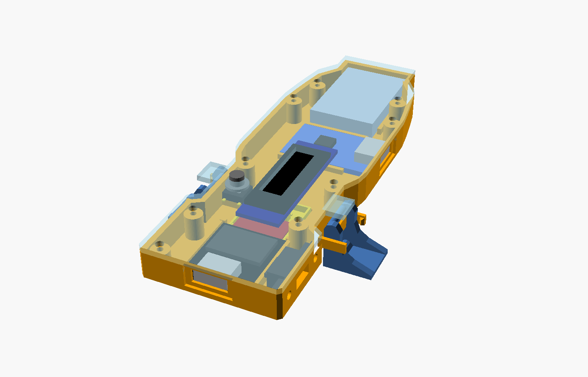
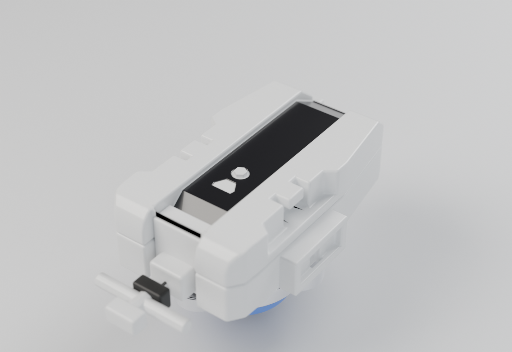

# Scatola piatta (corpo unico sul launcher)

La versione attuale del dispositivo: un corpo basso che si aggancia direttamente al launcher, senza la base LaunchLab. Corpo, vassoio del sensore, coperchio, 2 clip e cappuccio del tasto si stampano a parte. File: `hardware/enclosure/spinlite_flat.scad`.

**Schermo:** l'OLED 128x32 sta sotto il coperchio, sopra il vassoio, senza alzare il corpo. Firmware `spinlite_qre_oled`. Chi non lo vuole imposta `oled = false` e il coperchio resta chiuso.

**Tasto di presenza:** obbligatorio. Sta nel vassoio e appoggia direttamente sul pistoncino del launcher: niente perni e niente fori da fare. Senza tasto il firmware scarta tutti i lanci. Dettagli in [presenza della trottola](presenza-trottola.md).

**Stato: verificata solo a CAD. Nulla è stato stampato né provato sul launcher.** Le scatole precedenti restano in [hardware/README.md](../hardware/README.md) come archivio: non hanno il tasto di presenza, che lì richiederebbe di forare la base. Cosa comprare: [distinta base](../hardware/BOM.md).

## Cosa cambia

| | Scatola su base LaunchLab | Scatola piatta |
| --- | --- | --- |
| Pezzi | base LaunchLab + barretta + scatola + coperchio | corpo + vassoio del sensore + coperchio + 2 clip + cappuccio del tasto |
| Tasto di presenza | non previsto: servirebbe forare la base | direttamente sul pistoncino |
| Altezza sul launcher | circa 28 mm | circa 10 mm |
| Lunghezza | circa 70 mm | circa 113 mm |
| Licenze | base CC BY-SA a parte | tutto MIT |

## Da dove vengono le quote

La disposizione segue il progetto [Beyblade-Dragoon-RPM](https://github.com/Luciandraw/Beyblade-Dragoon-RPM) di Luciandraw, un dispositivo costruito davvero. I suoi modelli sono CC BY-NC-SA e non sono nel repo: la geometria è disegnata da zero, e da lì vengono solo idee e posizioni funzionali. Grazie a Luciandraw.

Quote riprese:

- altezza della faccia inferiore e della fascia centrale che entra nell'incavo del launcher;
- posizione del QRE1113 (Y 5,44) e del pistoncino (Y 13,05), e quota del cappuccio del tasto (Z 5,40);
- posizione del perno delle clip e dei loro denti;
- larghezza: il corpo non è più largo della sagoma di Dragoon. In lunghezza invece è spostato in avanti di circa 10 mm, così dietro resta a filo del launcher come il Battle Pass originale.

Nel suo modello le due clip non sono simmetriche di circa 0,7 mm: ho usato la destra, specchiata. Perno e dente coincidono con quelli delle clip di LaunchLab, un secondo progetto indipendente.

## Disposizione

Da dietro in avanti:

1. **SuperMini**, con la USB-C nella parete posteriore; **interruttore SS12F15** sul fianco +X.
2. **QRE1113 e tasto** nel fondo, con le **clip** ai lati.
3. **TP4056** di traverso, con la USB-C sul fianco +X.
4. **LiPo 502030**.

Sopra il vassoio, sotto il coperchio, c'è l'**OLED** per il lungo, con i pin verso la SuperMini. Accanto c'è il **tasto esterno**.

## Interfaccia

- **OLED:** mostra ultimo lancio, massimo e informazioni. Sopra il vassoio ci sono circa 5 mm liberi e il modulo ne occupa meno di 3, per questo non serve alzare il corpo.
- **Tasto esterno:** va in parallelo al BOOT (GPIO9), quindi il firmware non cambia. Una pressione cambia pagina dell'OLED. Tenuto premuto mentre accendi, mette la scheda in modalità di programmazione: serve se un firmware sbagliato blocca la USB.
- **LED:** con la scatola chiusa si vedono attraverso due zone sottili del coperchio, spesse 0,6 mm, ma solo se il coperchio è stampato in un filamento chiaro. Le zone sono larghe perché la posizione dei LED cambia da scheda a scheda.

## Fermi delle clip

Come nel Battle Pass originale, la clip chiusa è trattenuta a scatto. Ai lati di ogni clip escono dal fianco due **dita elastiche** con un dentino:

1. chiudendo, il braccio della clip spinge da parte il dentino e lo supera, e il dito flette di 0,3 mm;
2. a clip chiusa il dito torna dritto e il dentino resta davanti al braccio;
3. per aprire, la spinta del pollice sulla linguetta deve di nuovo far flettere il dito.

A flettere è il dito, sottile apposta (1 mm), non la clip. Da chiusa la clip ha circa 3° di gioco prima di toccare il dentino. Se lo scatto risulta troppo duro o troppo morbido si cambiano `detent_bite` (quanto entra il dentino) e `detent_t` (spessore del dito).

## Verso di montaggio

Sul launcher la finestrella del disco è più vicina alla corda, il foro del pistoncino più lontano. Il corpo si monta quindi con la **parte corta e la USB-C della SuperMini verso la corda** e la **parte lunga con la LiPo verso il fondo** del launcher.

| Dal pistoncino verso | Launcher (stima dalle foto) | Corpo | Sporgenza |
| --- | --- | --- | --- |
| Corda | circa 36 mm | 36 mm | a filo |
| Fondo | circa 62 mm | 77 mm | circa 15 mm |

Le misure del launcher sono ricavate da una foto, usando come scala i 7,6 mm tra finestrella e pistoncino: l'errore è di qualche mm. **Misura sul tuo launcher** la distanza tra il centro del pistoncino e il bordo lato corda, e impostala in `rear_len`: il retro del corpo segue da solo.

Nei render il launcher è ridisegnato dalle foto di uno vero, con la corda dal lato giusto. Forma e proporzioni sono quelle delle foto, ma le misure hanno un errore di qualche mm: non usarlo come riferimento per modificare il corpo.

## Prima prova: lo spezzone

Non stampare subito tutto il corpo. `part = "prova"` mette sul piatto solo la zona centrale di corpo e coperchio, con vassoio, clip e cappuccio: circa 7 g di filamento invece di 20. Lo spezzone si chiude con 4 viti. Ti dice le cose che il CAD non può verificare:

1. le clip si agganciano al launcher e tengono senza gioco;
2. il QRE1113 è sopra la finestrella del disco;
3. il tasto si chiude con la trottola inserita, senza impedire l'aggancio.

Se qualcosa non va, si corregge e si ristampa lo spezzone.

## Stampa

`part = "plate"` mette tutti i pezzi sul piatto, oppure singolarmente `"body"`, `"lid"`, `"tray"`, `"clips"` e `"button"`. In tutto servono circa 20 g di filamento.

- PETG, layer 0,2 mm.
- **Vassoio in filamento nero:** il sensore lavora a infrarossi e una plastica chiara e sottile può far passare luce ambiente.
- **Coperchio in filamento chiaro** se vuoi vedere i LED attraverso le zone sottili.
- Corpo, vassoio e coperchio senza supporti: ognuno appoggia su una faccia piana. Il vassoio è un pezzo a parte proprio per questo: la sua fascia sporge 1 mm sotto il fondo, e se fosse unita al corpo il resto del fondo resterebbe sospeso.
- Le clip si stampano coricate su un braccio, così gli strati seguono il verso in cui lavorano.
- Se la tua stampante è piccola, stampa i pezzi uno alla volta: il corpo è lungo 113 mm.

## Montaggio

1. **QRE1113**, nel vassoio: salda i tre fili direttamente al breakout, senza pettine. Sensore verso il basso nella finestra, PCB sugli appoggi tra le sponde, una goccia di colla a caldo sui bordi.
2. **Tasto SMD 6×6**, nel vassoio: cappuccio nel foro verso il basso, tra le sponde. Salda due fili su due piedini che si collegano solo a tasto premuto (trovali col tester). Una goccia di colla.
3. **Vassoio nel corpo**, da sotto: la fascia resta fuori e appoggia al fondo. Fissalo con qualche goccia di colla lungo il bordo; la spinta del pistoncino lo tiene comunque premuto contro il corpo.
4. **SuperMini**: USB-C nel foro della parete posteriore, scheda sui binari.
5. **Interruttore**: leva nella feritoia, 2 viti M2×6 da fuori e dado dentro.
6. **TP4056** tra le guide, con la USB-C nel foro del fianco. **LiPo** nel vano, su un velo di gommapiuma.
7. **Tasto esterno**: sulla torretta accanto al vassoio, cappuccio verso l'alto e piedini lungo il corpo, con una goccia di colla sotto. Due fili su due piedini che si collegano solo a tasto premuto.
8. Salda i collegamenti come nella [guida](guida.md). Il tasto di presenza va tra GPIO5 e GND, il tasto esterno tra GPIO9 e GND.
9. **OLED**: salda quattro fili direttamente alle piazzole, senza pettine, con i pin verso la SuperMini. Fissalo nella cornice del coperchio con il vetro contro la finestra e una goccia di colla sui bordi. SDA su GPIO6, SCL su GPIO7, alimentazione a 3V3.
10. **Clip**: appoggia ognuna sul blocco della cerniera tenendola quasi orizzontale, con il dente verso il launcher, poi chiudila: deve scattare oltre i dentini dei fermi.
11. **Cappuccio** nel foro del coperchio, con la flangia verso l'interno.
12. **Coperchio** con **9 viti M2×6**. Le sue alette tengono il perno delle clip nella sede.

## Da controllare al primo pezzo stampato

1. **Clip sul launcher.** Si devono agganciare e sganciare senza gioco. Nel primo spezzone, senza fermi, si sganciavano da sole: ora le tengono i fermi a scatto. Controlla che scattino e che restino chiuse anche capovolgendo e scuotendo. Dalle foto le sedi laterali sono all'altezza del pistoncino, come le clip del modello, ma sono cornici sporgenti con una feritoia rettangolare: nei render la loro forma è solo dedotta.
2. **Tasto e pistoncino.** Il cappuccio è alla stessa quota di Dragoon. Con la trottola inserita il contatto deve risultare premuto (`presenza` in console): se non si chiude, tutti i lanci vengono scartati. Se la trottola entra a fatica, serve un tasto a bassa forza (circa 100 gf).
3. **Altezza del cappuccio del tuo tasto:** `tact_h` e `tact_body`. La punta resta alla quota giusta da sola, entro i limiti controllati dagli `assert`.
4. **Breakout QRE:** `qre_pcb` e `qre_h`. Largo 9 mm sta nello spazio con 0,1 mm di margine verso il tasto: se è più largo, un `assert` lo segnala.
5. **Presa:** il corpo è lungo e piatto come quello di Dragoon, ma la comodità va provata in mano.
6. **Interruttore:** passo dei fori e corsa della leva sono stimati, come nell'altra scatola (`sf_pitch`, `sf_travel`).
7. **Retro a filo:** il corpo deve finire al bordo del launcher lato corda, e la maniglia a T riavvolta non deve toccare la parete con la USB-C. Se sporge o rientra, correggi `rear_len`.
8. **OLED:** misura il modulo (`oled_pcb`, `oled_glass`) e dov'è l'area visibile (`oled_win_dy`), che spesso non è al centro del PCB. Se il testo risulta capovolto, si cambia una riga del firmware (`0xA1, 0xC8` in `oled_ui.cpp`).
9. **LED:** verifica che si vedano attraverso le zone sottili. Se non si vedono, con la posizione vera del LED si può aprire un foro.
10. **Tasto esterno:** la corsa è di 0,25 mm. Il cappuccio deve appoggiare sul tasto senza premerlo a riposo.

## Verifiche fatte a CAD

- Corpo, vassoio, coperchio e clip sono ognuno un solido unico.
- Nessuna collisione tra QRE, tasti, cappuccio, OLED, SuperMini, TP4056, LiPo, interruttore, corpo, vassoio e coperchio, con `oled = true` (dopo lo spostamento in avanti non è stato ricontrollato `oled = false`).
- Fermi: la clip è libera da chiusa e fino a 3° di apertura, dal 4° tocca il dentino. Verso i 75° si libera di nuovo: è l'angolo per montarla.
- Il coperchio non tocca le dita dei fermi.
- Lo spezzone stampato (senza fermi) ha confermato aggancio, finestrella e posizione del pistoncino.
